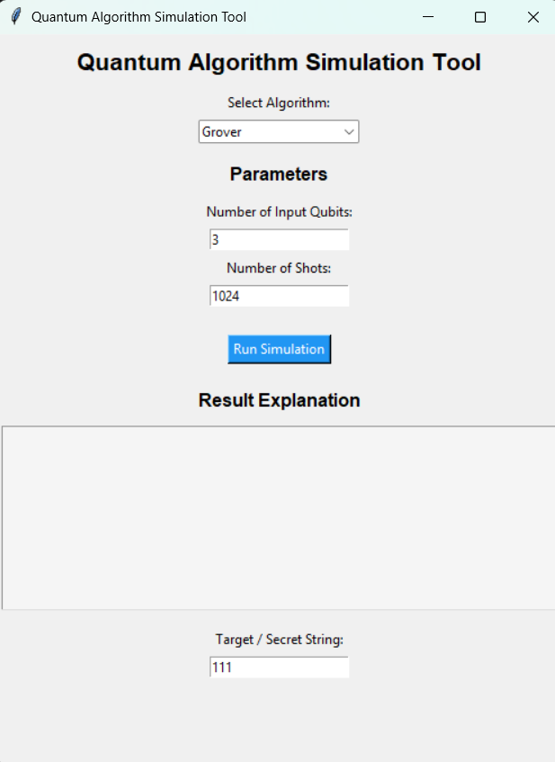
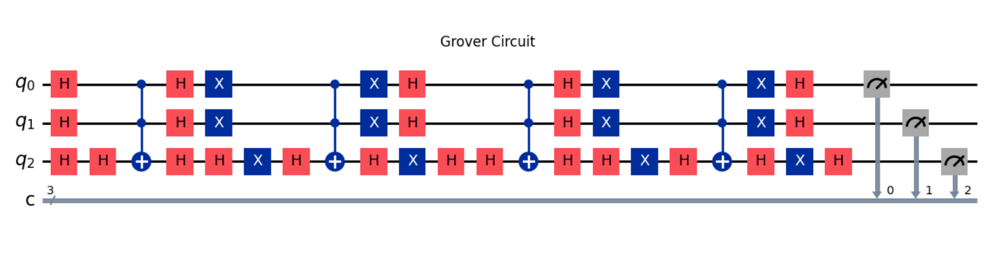
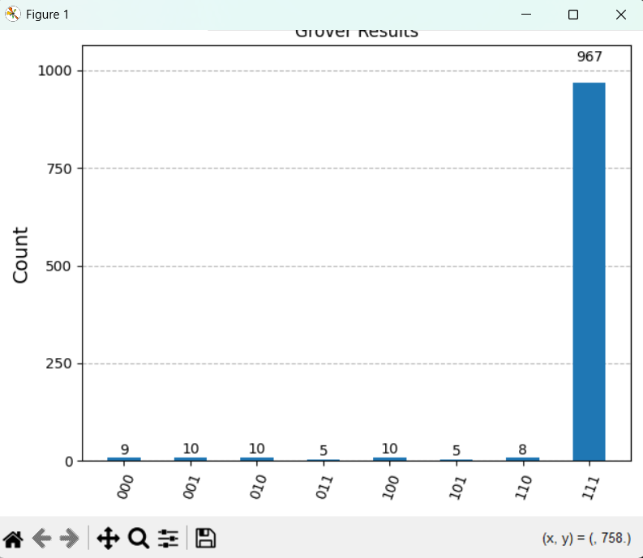
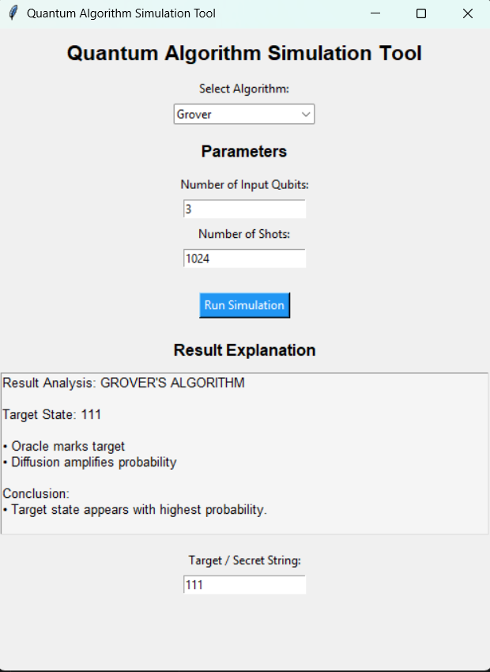

# ⚛️ Quantum Algorithm Simulator (Qiskit)

## 📌 Overview
This project is an interactive quantum computing simulator built using Qiskit. It provides a GUI-based interface to implement and visualize fundamental quantum algorithms.

The application allows users to dynamically generate quantum circuits, run simulations, and analyze results through visual outputs.

---

## 🚀 Tech Stack
- Python  
- Qiskit (Qiskit Aer - QASM Simulator)  
- Tkinter (GUI)  
- Matplotlib  

---

## 🧠 Algorithms Implemented
- Deutsch–Jozsa Algorithm  
- Grover’s Search Algorithm  
- Bernstein–Vazirani Algorithm  

---

## ⚙️ Features
- Interactive GUI for selecting algorithms  
- Dynamic n-qubit circuit generation  
- Custom input parameters (target state, oracle type, number of qubits)  
- Quantum circuit visualization  
- Measurement results displayed using histograms  
- Result interpretation displayed in GUI  

---

## 🔍 How It Works
1. Select an algorithm from the GUI  
2. Enter required parameters  
3. The circuit is dynamically generated  
4. Simulation runs using Qiskit Aer  
5. Results are displayed as histograms and explanations  

---

## 📊 Key Concepts Demonstrated
- Superposition  
- Quantum Parallelism  
- Interference  
- Amplitude Amplification (Grover’s Algorithm)  

---

## ▶️ How to Run

### 1. Install dependencies
```bash
pip install -r requirements.txt
```

### 2. Run the application
```bash
python main.py
```
## 🔎 Grover’s Algorithm Demo

This example demonstrates Grover’s Algorithm for a 3-qubit system where the target state is **111**.

### 🖥️ GUI Interface


### 🔬 Quantum Circuit


### 📊 Output Histogram


### 🧠 Result Explanation

---

## 🎯 Objective
To build a practical and interactive tool for understanding and visualizing core quantum computing algorithms.

---

## 📌 Future Improvements
- Add advanced algorithms (Quantum Fourier Transform, Shor’s Algorithm)  
- Improve GUI design and user experience  
- Deploy as a web-based quantum simulator  

---

## 📬 Contact
- LinkedIn: https://www.linkedin.com/in/ayushman-singh-444902283/
